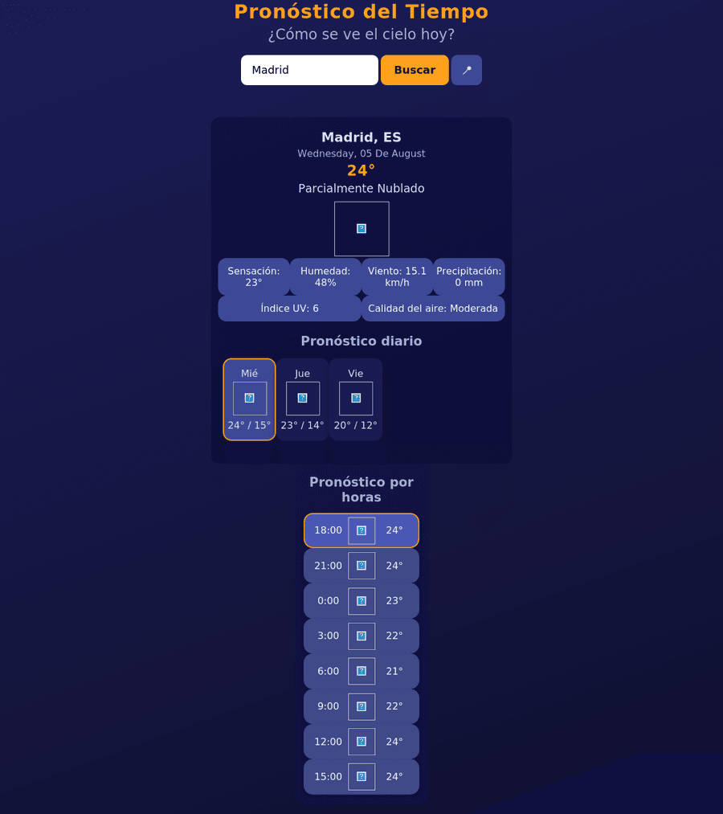
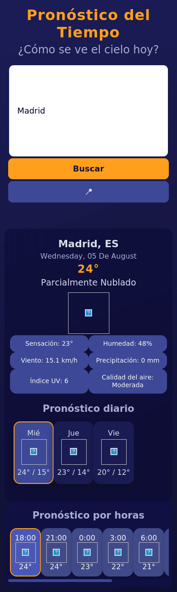

# 🌤️ App de Clima

Aplicación web que muestra el clima actual, el pronóstico por horas y el pronóstico diario de cualquier ciudad del mundo. Es mi primer proyecto usando HTML, CSS y JavaScript puro (sin frameworks).

Usa **tres proveedores de clima combinados**, en vez de depender de uno solo:

1. **[Open-Meteo](https://open-meteo.com/)** — proveedor principal (gratis, sin API key).
2. **[OpenWeather](https://openweathermap.org/api)** — respaldo automático: si Open-Meteo falla por cualquier motivo, la app cambia sola a OpenWeather sin que el usuario note nada.
3. **[WeatherAPI](https://www.weatherapi.com/)** — se consulta aparte, solo para datos extra que los otros dos no dan gratis: índice UV y calidad del aire. Si esa llamada falla (o no hay API key configurada), esos datos simplemente no se muestran; nunca rompe el resto de la app.

## ✨ Funcionalidades

- 🔍 Búsqueda de clima por nombre de ciudad.
- 📍 Búsqueda automática por ubicación actual (geolocalización del navegador).
- 🔁 Estrategia de **respaldo entre proveedores**: Open-Meteo primero, OpenWeather si falla.
- ☀️ Índice UV y 🌫️ calidad del aire (vía WeatherAPI), cuando hay API key configurada.
- 🕒 Pronóstico por horas (próximas 24 h), con la tarjeta más cercana a la hora actual resaltada.
- 📅 Pronóstico diario, con la tarjeta del día de hoy resaltada.
- 💾 Recuerda la última ciudad buscada (`localStorage`) y la vuelve a cargar automáticamente al abrir la app.
- 📱 Diseño responsivo: se adapta a escritorio, tablet y móvil.
- ⚠️ Manejo de errores: ciudad no encontrada (en ningún proveedor), sin conexión, permiso de ubicación denegado, navegador sin soporte de geolocalización, etc.

## 📸 Capturas de pantalla

| Escritorio | Móvil |
|---|---|
|  |  |

## 🧭 Estrategia de proveedores

```
Usuario busca una ciudad / usa su ubicación
              │
              ▼
       ¿Open-Meteo responde?
        │              │
       Sí              No
        │              │
        ▼              ▼
   Usar esos      Usar OpenWeather
     datos          (respaldo)
        │              │
        └──────┬───────┘
               ▼
   Pedir a WeatherAPI datos extra
   (UV / calidad del aire), best-effort:
   si falla, esos datos no se muestran
   pero el resto de la app sigue igual.
```

Cuando se usa el respaldo (OpenWeather), la interfaz lo indica con una nota discreta ("Datos de respaldo") para que quede claro de dónde vienen los datos.

## 🛠️ Tecnologías

- HTML5
- CSS3 (Flexbox, media queries para diseño responsivo)
- JavaScript (Vanilla, `fetch`, `async`/`await`, `localStorage`, Geolocation API)
- [Open-Meteo](https://open-meteo.com/) — clima principal y geocodificación de ciudades (sin API key)
- [OpenWeather](https://openweathermap.org/api) — respaldo si Open-Meteo falla
- [WeatherAPI](https://www.weatherapi.com/) — índice UV y calidad del aire (best-effort)

## 🚀 Cómo ejecutarlo localmente

1. **Clona o descarga** este repositorio.
2. Abre `js/proveedores.js` y configura tus propias API keys:
   - **OpenWeather** (respaldo): consigue una gratis en [openweathermap.org](https://home.openweathermap.org/users/sign_up) y reemplázala en:
     ```js
     const OPENWEATHER_API_KEY = 'TU_API_KEY_AQUI';
     ```
   - **WeatherAPI** (opcional, solo para UV y calidad del aire): consigue una gratis en [weatherapi.com](https://www.weatherapi.com/signup.aspx) y reemplázala en:
     ```js
     const WEATHERAPI_API_KEY = 'TU_API_KEY_AQUI';
     ```
     Si dejas el valor de ejemplo (`'TU_API_KEY_DE_WEATHERAPI'`), la app simplemente no pedirá ni mostrará esos datos extra; el resto funciona igual.
   - Open-Meteo no necesita API key.
3. **Abre `index.html` en tu navegador.**
   - Para probar el buscador por ciudad, con abrir el archivo directamente alcanza.
   - Para probar el botón de **ubicación** 📍, algunos navegadores (especialmente Safari) bloquean la geolocalización cuando el archivo se abre como `file://`. En ese caso, sirve la carpeta con un servidor local, por ejemplo:
     ```bash
     python3 -m http.server
     ```
     y entra a `http://localhost:8000`.

No requiere instalación de dependencias ni build: es HTML, CSS y JS plano.

> ⚠️ **Nota de seguridad:** como este proyecto no tiene backend, las API keys quedan visibles en el código fuente para cualquiera que abra `js/proveedores.js` o inspeccione el navegador. Para un proyecto de portafolio no es grave (son planes gratuitos), pero no reutilices keys de otros proyectos aquí, y si en algún momento la app crece y maneja tráfico real, lo correcto es mover las llamadas a un backend propio para no exponerlas.

## 📂 Estructura del proyecto

```
AppDeClima/
├── index.html
├── css/
│   └── estilos.css
├── js/
│   ├── proveedores.js   # Open-Meteo, OpenWeather y WeatherAPI: llamadas y normalización de datos
│   ├── app.js           # Orquesta los proveedores, geolocalización, localStorage y renderizado
│   ├── hora.js          # Pronóstico por horas
│   └── dia.js           # Pronóstico diario
└── screenshots/
```

## 🔮 Posibles mejoras futuras

- Selector de unidades (°C / °F).
- Autocompletado de ciudades mientras se escribe.
- Modo oscuro / claro.
- Guardar varias ciudades favoritas, no solo la última.
- Cachear resultados recientes para reducir llamadas a las APIs.
- Mover las API keys a variables de entorno si el proyecto pasa a tener un backend.

---

Hecho como parte de mi aprendizaje de HTML, CSS y JavaScript. ¡Cualquier sugerencia es bienvenida!
